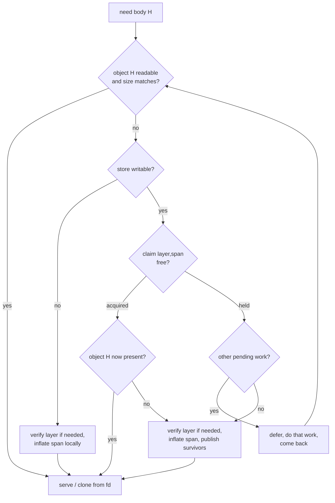

# Shared content cache

Status: in progress. Delivery steps 1 (tables) and 2 (store, publishing and
FUSE) are implemented; the rest is proposed.

## Problem

Every launch prepares its rootfs from scratch. When the same image is started
N times at once, the host does N times the following:

- hashes every layer blob in full ([`Source::verify`](../source/src/lazy/source.rs));
- inflates the same spans, whether through the profile's fetch-ahead, on
  demand ([`Served::fetch`](../source/src/lazy/fs.rs)) or by eager extraction
  ([`spans::extract`](../source/src/extract/spans.rs));
- writes the same bytes into a private `backing/` or `rootfs/` under
  `std::env::temp_dir()`;
- plans the image from the per-layer entry tables
  ([`Plan::build`](../source/src/extract/plan.rs)).

This happens even with the FUSE backend, and nothing is shared between
launches.

## Goals

- Share file content between launches of the same user on the same host, so
  that N concurrent launches cost about as much as one.
- Work across scopes: a plain shell, `bazel run`, `bazel test` with
  `no-sandbox`, and `linux-sandbox`, including a sandbox that can only read the
  cache.
- Move image planning to build time, where Bazel caches it.

## Non-goals

- Sharing between users or hosts. Remote execution simply does not share.
- Caching metadata such as mode, ownership, xattrs or mtime. The index carries
  those.
- A daemon, or a FUSE mount shared between launches.
- Changing what the container sees. A hit, a miss and a disabled cache must
  give byte-identical views.
- Sharing layer indexes between different image targets. It would need a
  target per layer, which may not be possible with how rules_oci currently
  works in Bazel. Sharing across generations of the same image is in scope
  (see Phase B).

## Invariants

Every part of the design must preserve these.

1. **Objects are never written through.** No writes from the launcher or the
   container ever reach an object inode. Bundles never hard-link to objects,
   and anything opened with write intent is copied first.
2. **An object named `H` contains `H`.** Content is hashed and checked against
   the index before it is published. Publishing is atomic (`linkat`). Nothing
   writes to an object after it is linked.
3. **The cache is optional.** Any cache failure falls back to today's
   behaviour for that file or that launch, not to an error. Invalid inputs
   are different: they fail the run (see [Hash mismatch](#hash-mismatch)).
4. **One store per user.** The store must be owned by the caller and mode
   `0700`, or it is not used.
5. **Coordination uses only files in the store and OFD locks.** Nothing
   depends on PIDs, environment variables, sockets, `/tmp` or `/dev/shm`, since
   none of these are shared reliably across Bazel's scopes.
6. **Nothing waits on another process.** Work claimed elsewhere is deferred,
   not waited for. Once a launch has nothing else to do, it does the claimed
   work itself. The only waits allowed are on threads of the same launch,
   which run and stop together.
7. **Layer bytes are only used after that layer's digest has been checked.**
   The same rule as today, now applied only to layers that are actually
   read from, whether by inflating or, for uncompressed layers, by copying.

## Build side

### Per-layer entry table (`OTE3`)

This extends [`entries::Table`](../source/src/entries.rs) (`OTE2` today):

- the layer digest it was built from, stored inside the file and checked on
  read;
- `sha256` of the logical content of every `File` and `Sparse` entry. A
  `Sparse` entry is hashed as its reassembled bytes, so it shares objects with
  plain files.

The table is built by `oci_runtime index --blob` (this already exists as
[`index_blob`](../source/src/main.rs)). Hashing runs in the same pass that
walks the tar stream.

**Uncompressed layers get a table too.** Today
[`index_blob`](../source/src/main.rs) skips them. That means
[`lazy::serve`](../source/src/lazy/mod.rs) refuses any image containing one,
and every launch walks their tar headers, which first needs the whole layer
hashed. For these layers:

- Offsets point straight into the blob.
- There is no `.zinfo`. The launcher makes a `Stored` index in memory
  instead, so the span route and FUSE take these layers like any other.
- The index action walks the headers and hashes the bodies, with nothing to
  inflate.
- Spans are fixed 4 MiB windows over the blob, chosen at run time since
  nothing records them. They exist only to key claims and size work units.

### Rootfs table (`OTR1`)

This is new: the resolved image for one platform manifest. It replaces
runtime planning when present. It is produced by a new subcommand,
`oci_runtime stitch`, from the manifest, the config and the per-layer tables.

It contains:

- **Header:** magic, manifest digest, platform.
- **Layers:** every manifest layer in order, with its digest and only the
  entries something is placed from. A layer that is fully shadowed is empty,
  so it can be left unverified and unmapped at runtime.
- **Directories**, parents before children, which is what
  [`Tree::build`](../source/src/lazy/tree.rs) consumes.
- **Work:** per layer the files in stream order, then symlinks and hard
  links, as indices into the layers above. Each entry keeps path, kind, mode,
  mtime, link target and, for files, `size`, `sha256` and its offset in the
  layer, which is needed to inflate on a miss.
- **Extended attribute names** of every entry, shadowed ones included, so
  warnings and `--strict-xattrs` behave as they do today.
- **What is dropped:** shadowed entries, whiteouts, opaque markers, and
  `Unsupported` entries (the tree never holds them).

An image that only the walk can place (a sparse file, an entry resolved
through a symlink, a hard link the plan cannot follow) gets no rootfs table,
and is planned and walked at runtime as before. Every index, kind and path in
a table is checked when it is read.

Checkpoint indexes (`.zinfo`) stay one per compressed layer. They could be
trimmed to checkpoints for spans that contain surviving files, because gzip
checkpoints carry 32 KiB windows. That trimming is optional.

At runtime, `--rootfs-tables DIR` names the directory, and the launcher reads
`<manifest hex>.rootfs` for the manifest it resolved. With no such file, it
uses today's path (per-layer tables plus `Plan::build`).

### Bazel wiring

- **Phase A (no dependency on upstream):** keep one `OciLayerIndex` action per
  image ([runc_binary.bzl](../lib/private/runc_binary.bzl)), running
  `index --layout ... --rootfs-tables`. It writes the `OTE3` tables into the
  existing `<name>.zinfo/` directory, and one `OTR1` table per platform
  manifest into a new `<name>.rootfs/` directory, which `.launch.json` names
  as `rootfs`. The runtime benefits land here.
- **Phase B (`ctx.actions.map_directory`):** fan out over the layout, with one
  `oci_runtime index --blob` action per file under `blobs/sha256/`, each
  writing `<hex>.zinfo` and `<hex>.entries` into `<name>.zinfo/`. A separate
  `OciRootfsStitch` action then reads `<name>.zinfo/` and the layout's
  manifests and writes `<name>.rootfs/`. The outputs are the same as in
  Phase A, so the launcher does not change.
  - **Blobs that are not layers.** Only a blob's content says what it is, so
    each action inspects its blob:
    - compressed layer: gzip or zstd magic;
    - uncompressed layer: `ustar` magic at offset 257;
    - anything else (manifests, configs, indexes, and old v7 tars without
      the magic).

    Anything else gets both outputs empty. An uncompressed layer gets a real
    `.entries` and an empty `.zinfo`. An empty sidecar means "not indexed"
    and is skipped silently, unlike an unreadable one, which is still warned
    about.
  - **What this buys.** Layer indexes are shared across generations of an
    image. When an update changes some layers, only those are indexed again,
    and the unchanged ones hit the action cache, locally or remotely. Each
    generated action's key includes its input and output paths, which stay
    the same from one generation of a target to the next but differ between
    targets. So sharing stops at the target boundary, which is a non-goal.
  - **Availability.** `bazel_compatibility` allows `>=8.1.0`, so
    feature-detect `map_directory` with `hasattr(ctx.actions,
    "map_directory")` and fall back to Phase A when it is missing.
  - **Source directories.** `File.is_directory` is `False` for source
    directories, so `map_directory` cannot take them
    ([bazelbuild/bazel#31273](https://github.com/bazelbuild/bazel/pull/31273)
    makes this opt-in). `_image_layout` already requires `is_directory`, so
    no layout that works today is lost. If `map_directory` turns out not to
    work for source directories once they are accepted, drop Phase B and keep
    Phase A.
- `OciProfileCheck` passes `--rootfs-tables`, so it checks against the rootfs
  table instead of replanning.

## The store

### Location

- The root is `<pw_dir>/.cache/rules_oci_runtime/v1`, where `pw_dir` comes
  from `getpwuid(geteuid())`. `$HOME` and `$XDG_CACHE_HOME` are deliberately
  ignored: Bazel's test runner repoints the first and strips the second.
- `--cache-dir DIR` overrides the root. It exists for tests and benchmarks and
  is not written into `.launch.json` by the rules, because an absolute host
  path in an action key hurts remote-cache hits.
- `--cache auto|read-only|off`, default `auto`.
- If the default root resolves inside `$TEST_TMPDIR` or `$TMPDIR`, the
  launcher does not write to it, since nothing written there would be read
  again. A root named with `--cache-dir` is taken at its word.
- `v1` is the layout version. A new version starts empty. Reaping old versions
  is an open question.

### Opening the store

1. Create the root with `mkdir -p`, mode `0700`, and open it
   `O_DIRECTORY | O_NOFOLLOW`.
2. Require `fstat.st_uid == geteuid()` and `st_mode & 0o077 == 0`. Otherwise
   log a warning and run as `off`. Both sides of the uid check are seen
   through the same user-namespace mapping, so it holds under identity,
   fake-root and `nobody` mappings.
3. Check the filesystem with `fstatfs`. On NFS (`f_type == NFS_SUPER_MAGIC`),
   log a warning and run as `off`, even when the store was named with
   `--cache-dir`. NFS can't be trusted for `O_TMPFILE`, OFD locks, atime or
   `FICLONE`.
4. Resolve every later path with `openat2` relative to the root descriptor,
   using `RESOLVE_BENEATH | RESOLVE_NO_SYMLINKS`. No absolute path is ever
   written inside the store, so it still works when a sandbox mounts it
   elsewhere (`--sandbox_add_mount_pair`).
5. Whether the store is writable is found by trying to write, never with
   `access(2)`. `EROFS`, `EACCES` or `EPERM` on the first write puts the launch
   into read-only mode.

### Layout

```
v1/
├── objects/<aa>/<sha256 hex>   content only, mode 0444, never rewritten
├── claims                      one empty file, locked by byte range
├── bundles/<id>/               per-launch bundles (only when writable)
│   └── lock                    held for the bundle's lifetime
├── gc.lock
└── gc.cursor                   next shard to sweep; its mtime is the last run
```

Shard directories (`objects/00` to `objects/ff`) are created on demand
(`EEXIST` is fine) and are never removed.

## Publishing (`O_TMPFILE`)

For each file body produced by inflating a span, or copied out of an
uncompressed layer:

1. `openat(objects/<aa>, O_TMPFILE | O_RDWR, 0o444)`.
2. Write the body and hash it in the same pass.
3. Compare the hash with the index. A mismatch is not published (see
   [Hash mismatch](#hash-mismatch)).
4. `linkat(AT_FDCWD, "/proc/self/fd/<n>", objects_fd, "<aa>/<hex>",
   AT_SYMLINK_FOLLOW)`. `AT_EMPTY_PATH` is not used, because it needs
   `CAP_DAC_READ_SEARCH`.
5. Whatever happened in step 4, keep using this descriptor as the content.
   There is no reopen and no fallback path: the fd is valid whether or not the
   name was published.

The descriptor is wrapped in a type that only exposes reads and clones. After
a successful link it *is* the object (invariant 1).

| Result of `linkat` | Meaning | Action |
|---|---|---|
| success | published | keep fd |
| `EEXIST` | another launch published first | keep fd, count as "lost race" |
| `ENOENT` | `/proc` missing or shard gone | keep fd; stop publishing for this launch |
| `ENOSPC`, `EDQUOT` | store full | keep fd; stop publishing |
| `EROFS`, `EACCES`, `EPERM` | read-only scope | keep fd; switch to read-only |
| other | unexpected | keep fd; warn once; stop publishing |

If `O_TMPFILE` itself fails with `EOPNOTSUPP` or `EISDIR` (some NFS setups,
FUSE filesystems, older overlayfs), the store is read-only for this launch.
There is no fallback to a named temporary file.

An unlinked temporary file is freed on close, including after SIGKILL, and
the journal cleans it up after a crash. So temporary files are never orphaned
and GC never has to look for them.

### Hash mismatch

If the table's hash disagrees with bytes inflated from a verified layer, the
launcher was given invalid or corrupted inputs, and the run fails. Nothing is
published, and the error names the layer and the offset. Bodies are checked on
the way into the store; a launch with no writable store trusts the layer
digest alone, as it does today.

- **Eager:** extraction stops and the launch exits with an error before the
  container starts.
- **FUSE:** the read that found the mismatch gets `EIO`. The launcher then
  kills the container (`runc kill <id> KILL` against its private state root)
  and exits with the error rather than the container's status.

The same applies when an `OTE3` or `OTR1` table names a different layer or
manifest from the one it sits beside. A missing table still just falls back.
Damage to the store is not an input error: a bad object counts as a miss
(see [Reading](#reading)).

## Reading

1. `openat2(objects/<aa>, "<hex>", O_RDONLY | O_NOFOLLOW)`, with the shard
   directory's descriptor opened once per launch.
2. `statx(fd, STATX_SIZE | STATX_ATIME)`. If `st_size` differs from the index,
   the object counts as a miss. This catches a file emptied by a crash before
   its data reached disk.
3. If `now - atime > touch threshold` (default 1 day), and the store is
   writable, call `futimens(fd, {UTIME_NOW, UTIME_OMIT})`. This keeps atime
   meaningful on `noatime` mounts, and on reads that do not update atime
   (`FICLONE`, some `copy_file_range` and passthrough paths). It costs one
   syscall per object per threshold period.
4. `ENOENT` (reaped) or any other error counts as a miss.

Empty files need no object.

Every other regular file is its own object, however small. Packing the small
files of a span into one object is deferred. Revisit it if lookups on warm
hits (`openat2` + `statx` + `close` per file) come to dominate
`//:bench_counts_test`.

## Claims

A claim reduces duplicated work without any launch ever waiting for another.
It is a hint, not what makes the store correct: that comes from content
addressing and `linkat`, so two launches inflating the same span only costs
CPU. Only a writable store takes claims. Read-only scopes inflate locally.

- **Key:** `(layer digest, span index)`, because that is the unit inflation
  costs. For an uncompressed layer, the span is the fixed window of the blob
  the body starts in. The lock offset is the first 5 bytes of `sha256(key)`,
  length 1, on `claims`. Two keys landing on the same offset only defer each
  other needlessly.
- **Lock:** OFD byte-range locks (`F_OFD_SETLK`, `F_WRLCK`), never
  `F_OFD_SETLKW`. They belong to the open file description, are released on
  close or death, and work across mount, user and PID namespaces. Locks on the
  same open file description do not conflict, so each worker thread opens
  `claims` separately.
- **Taking a claim:** after a lookup misses, try the claim once. If it is
  acquired, look the object up again, since the previous holder may have just
  published it. Then inflate, publish, and release.
- **A held claim defers the work.** The unit goes to the back of the worker's
  deferred list, and the worker moves on to other pending work.
- **Taking over:** when a worker has no other pending work, it goes back
  through its deferred units in order:
  1. Look the object up again. If it is there, the unit was done elsewhere;
     drop it.
  2. Try the claim again.
  3. If it is still held, inflate without it.

  So a holder that is stopped, slow or dead costs at most duplicated work,
  and its span still reaches the store.
- **What counts as other pending work:**
  - eager: the remaining span units in the extraction queue;
  - FUSE fetch-ahead: the rest of the profile queue;
  - FUSE demand (the container is blocked on this file): nothing. The worker
    looks up once more and takes over immediately, since any other work would
    only delay the container.
- **In-process:** the shard mutex in `Served::fetch` stays. It is the one
  remaining wait, and it is on another thread of the same launch, whose span
  is certainly being worked on.
- **When inflating, with or without the claim:** publish every surviving file
  of *this* image in the window. Another image that shares the layer may need
  files this image shadowed. It will miss and inflate again, which is
  acceptable.
- If `claims` can't be opened read-write, run without claims.



## Using the content

### Bundles

When the store is writable, bundles go in `v1/bundles/<id>/` instead of
`std::env::temp_dir()`. That puts them on the same mount as `objects/`, which
`FICLONE` requires: it returns `EXDEV` across mounts even on the same
filesystem. When the store is read-only or off, bundles stay where they are
today.

- The launcher holds `flock(LOCK_EX)` on `bundles/<id>/lock` for the bundle's
  lifetime. The detached `__remove` helper ([bundle.rs](../source/src/bundle.rs))
  inherits that descriptor, so the bundle is never unheld while it exists.
- **Sweep:** at startup, with a bound of 16 entries, remove any `bundles/*`
  whose lock can be taken with `LOCK_NB`. A bundle with no lock file may be one
  being made, so it is only removed once it is a day old. Two removals running
  at once are tolerated. The sweep is needed because nothing cleans
  up a persistent directory the way `/tmp` is cleaned, and the sandbox kills
  the detached remover.
- `--keep-bundle` keeps the bundle under the temporary directory, since the
  next sweep would take a kept bundle in the store.
- The FUSE mount lives in the launcher's private mount namespace, so the
  mount point being under `$HOME` is invisible to anything else.

### FUSE route

- A tree node becomes `Content::Object` on a hit or after publishing. Reads
  use `pread` on that fd. FUSE passthrough is not used for objects: the kernel
  keeps one backing reference per inode, which would outlive a later copy-up.
- A write-intent open (`O_WRONLY`, `O_RDWR`, `O_TRUNC`) or a size-changing
  `setattr` copies into `backing/<ino>` (`FICLONE`, then `copy_file_range`,
  then read/write) and switches the node to `Content::Backed`. A handle on an
  object refuses writes.
- Empty files are placed without an object and without inflating anything.
- Fetch-ahead from the profile goes through the same lookup, claim and
  publish path. Spans claimed elsewhere are deferred to the end of its queue.

### Eager route

- **Hit:** clone the object into the bundle path (`FICLONE`, then
  `copy_file_range`, then read/write), then apply metadata from the rootfs
  table.
- **Miss:** inflate the span under a claim and publish. Spans claimed
  elsewhere are deferred until the rest of the queue is done. Write the bundle
  copy by cloning from the fd if possible, otherwise directly from the
  in-memory buffer.
- **Hard link groups:** one copy, linked inside the bundle, never to an
  object.
- ext4 has no reflink, so eager extraction there still writes the whole rootfs
  to disk on every launch. It saves CPU, not I/O, and may be slower than
  today's tmpfs `/tmp`. On such filesystems, prefer FUSE.

## Verification

- Verify only layers that are actually read from, before the first byte from
  each is used. A launch where every file is a hit hashes no blobs, including
  uncompressed ones.
- Layers the rootfs table holds no entries for are never verified.
- On the FUSE route, a background low-priority pass may verify the
  contributing layers early, so the first miss does not pay for a full hash.
  The first inflate from a layer still waits for that layer's check. That
  wait is on this launch's own thread, like the in-process mutex.
- A hit trusts the rootfs table and the store. The table is a build output in
  the same runfiles as the layout, so it has the same trust as today's
  sidecars. The store is protected by invariants 2 and 4.

## Garbage collection

- **When:** at the end of a launch, opportunistically. Take
  `flock(gc.lock, LOCK_EX | LOCK_NB)`; if it is held, skip. Also skip if the
  `gc.cursor` mtime is newer than the GC interval (default 1 hour).
- **How much:** one shard per run (`objects/<cursor>`), with the cursor
  advancing, so no run walks the whole store. Runs as `SCHED_IDLE` with idle
  I/O priority. Being killed at any point is harmless.
- **What:** regular files named by a 64-character hex hash and owned by the
  caller, found with `getdents` and `statx`, never following symlinks. Reap
  those with `atime` older than the retention period (default 14 days).
  Optionally also reap the oldest objects in the shard while the store is
  over a size cap.
- **Safety:** unlinking an object another launch has open is harmless, since
  its fd keeps working. A lookup racing an unlink simply misses. The current
  launch's own hashes can be skipped cheaply. No other coordination is needed.
- **Never** remove shard directories or `claims`.
- **Read-only scopes** can't touch atime. Objects used only there age out and
  are published again by the next writable launch.

## Scopes (Bazel)

| Scope | Store | Notes |
|---|---|---|
| shell / `bazel run` | read-write | |
| `bazel test`, `no-sandbox` | read-write | found via `getpwuid`; `$HOME` is ignored |
| `linux-sandbox` | read-only by default | read-write with `--sandbox_writable_path=<root>` |
| hermetic sandbox | not visible | needs `--sandbox_add_mount_pair=<root>` |
| remote / Docker sandbox | none | falls back to today's behaviour |

When the store turns out to be read-only, log a one-line hint naming the
`--sandbox_writable_path` flag. Recommended flags belong in the user's
`~/.bazelrc`, since the path is absolute and per-user.

Today the launcher cannot run inside `linux-sandbox` at all, because it needs
nested user namespaces (see the `no-sandbox` tags in the e2e modules). That
is a separate problem from this design.

## Observability

Add counters, printed with `--verbose` and in a form `bench_run` can read:

- spans inflated, objects hit, objects published, objects lost to a race;
- claims deferred, deferred units found done elsewhere, claims taken over;
- layers verified, layers skipped;
- store mode (read-write, read-only, off) and why.

These are counts, so they survive a busy host. `//:bench_counts_test` gains
cold-store and warm-store cases.

## Testing

- **Unit:**
  - publishing: success, `EEXIST` keeps serving from the temporary fd,
    `ENOSPC`, `EROFS`;
  - a size mismatch counts as a miss;
  - the ownership and mode check refuses a foreign or group-writable root;
  - two open file descriptions contend for a claim: the loser defers, then
    takes over once it has nothing else to do;
  - a FUSE demand fetch takes over at once rather than deferring;
  - GC reaps by atime, skips young objects, and ignores foreign names and
    symlinks;
  - the touch threshold.
- **Integration (outside Bazel):**
  - two launches under `unshare -m`, each with its own `/tmp`, `HOME` and
    `TMPDIR`, sharing one store: the second inflates 0 spans;
  - the same with the store bind-mounted read-only: hits, but no publishes;
  - SIGSTOP a launch while it holds a claim: the other finishes without
    waiting, takes the span over, and publishes its objects;
  - N concurrent cold launches inflate about one launch's worth of spans in
    total, plus the takeovers they report;
  - an image with an uncompressed layer is served by FUSE, and a warm launch
    of it hashes no blobs.
- **Conformance:** run every case with a cold, warm, read-only and disabled
  store. The trees must be identical.
- **Smoke:** the same targets with `--cache off` and `--cache auto`.

## Delivery

These are stacked branches. Each one is measured on its own, and commit
bodies carry the numbers.

1. **Tables:** `OTE3` (layer digest, SHA-256 per file, uncompressed layers),
   `OTR1` and `oci_runtime stitch`, with Phase A wiring. The launcher reads
   `OTR1` in place of `Plan::build`.
   - Measure: index action time, launcher start-up syscalls.
2. **Store, publishing and FUSE:** opening the store, publishing and reading;
   FUSE serving from object fds, copy on write, and bundles in the store with
   the sweep.
   - Measure: spans inflated, cold against warm.
3. **Claims.**
   - Measure: total spans inflated and takeovers across N concurrent cold
     launches.
4. **Lazy verification.**
   - Measure: blobs hashed per launch, warm.
5. **Eager route on the store:** clone or copy from objects.
   - Measure: bytes written per launch on btrfs or xfs against ext4.
6. **GC.**
7. **Phase B wiring:** `map_directory` fan-out, the stitch action, and the
   fallback to Phase A.
   - Measure: index action time after changing one layer of a multi-layer
     image.

## Open questions

- Default size cap for GC, if any, and whether to reap old `vN` directories.
- Whether bodies of uncompressed layers may be served straight from the blob,
  each checked against its hash in the table instead of by the layer digest.
  That relaxes invariant 7, and moves the trust from the layer digest to the
  table.
- Whether read-only scopes should check writers' claims with `F_OFD_GETLK` on
  a read-only fd, and defer claimed spans the same way, without ever taking a
  claim.
- Whether a FUSE demand fetch should first run one deferred or fetch-ahead
  unit before taking over, trading a little latency for fewer duplicated
  spans.
